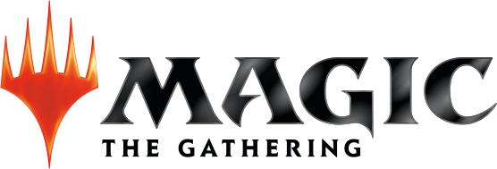
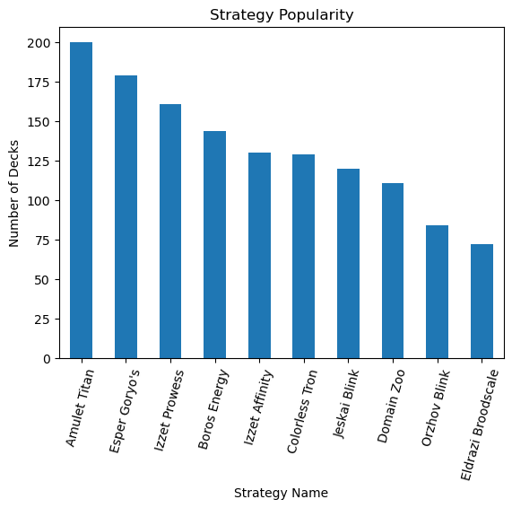
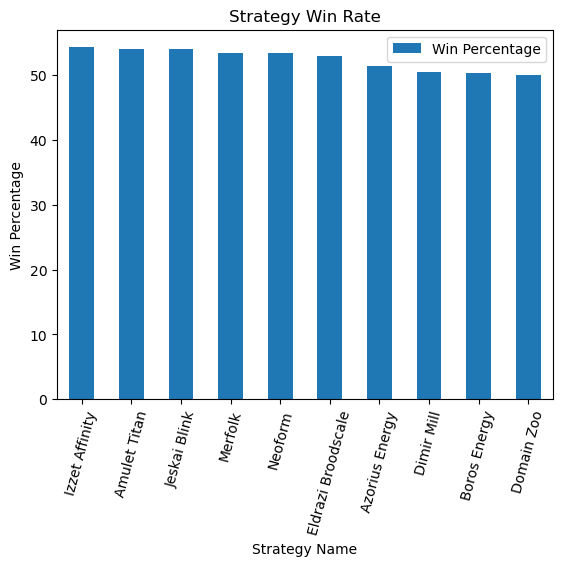
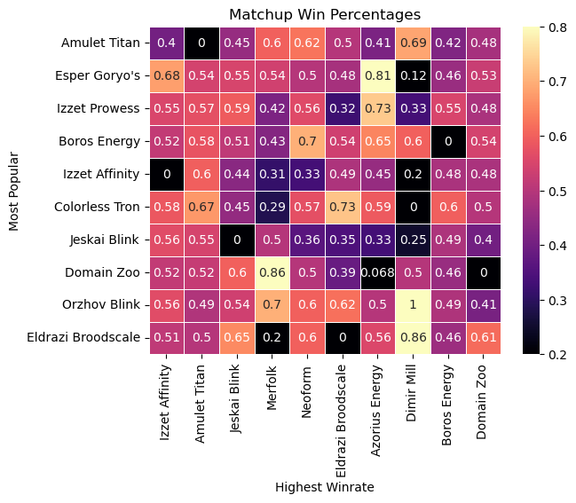
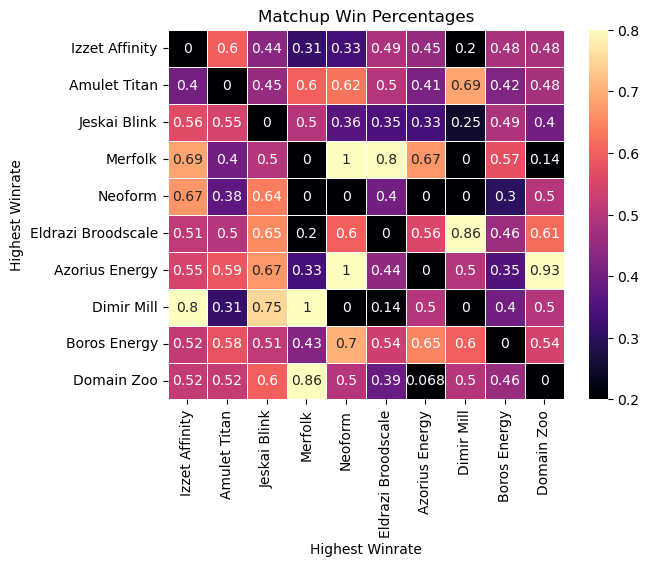

# MTG Tournament Data Scraper

This project will scrape the tournament data from melee.gg for any tournament you want. The main goal was to create a way to get deck representation and deck win rates from a given tournament or list of tournaments.

# Project Proposal
The main question that this project is trying to answer is "What is the best strategy choice to win the next tournament?". The best way to inform this descision is to look at winrates of each deck. This will be broken down into winrates by deck, and ,maybe sometime in the future, broken down further into winrates by deck by tournament. Winrates for decks are considered to be high when they exceed 50%. The best indicator for a deck is consistently high winrate across multiple tournaments.

# Data Source
All data is pulled from melee.gg. This site is the official tournament organizer for Wizards of the Coast (Owner of MTG). I specifically scrapped the data for each participant in the tournament. This includes their deck choice, name, and win/loss/draw. I also scrapped their complete decklist and all individual round data. I used 6 tournaments from the end of August 2025 till the beggining of November 2025. All the tournaments had over 80 participants with the largest having 1045 participants.

# Cleaning the Data
The biggest cleaning issue was with "Deck Name". It appears to me that each individual is able to label what their deck strategy is when they register for a tournament. This creates a ton of inconsitency in what each strategy actually means. Strategies in general are how a deck wants to use its cards to win a game. The three main categories for a strategy are agressive, value oriented and combo (using a combination of cards to win in one turn). Strategies can be strong versus one strategy  and weak to another. Each decks have cards that define the specific strategy it is using. I went through each of the major deck strategies and picked out 3 cards that categorized that decklist as a specific strategy. If a deck had all three of those cards in it, I renamed it to the most common title for that strategy. Spending more time on this could lead to a better consolidation of deck strategies. 
Most tournaments are organized into two main phases: swiss and top 8. Swiss is a style of pairing two participants with similar win/loss records with each other. At the end of thse pairing, the 8 participants with the most wins get to go against each other in single elimination for the grand prize. This will scue data as most decks will not make it past the initial swiss phase. There are also many participants that will not complete the tournament if they lose two or three rounds. This can limit potential data points for underrepresented decks. This creates less round data as the tournament goes on.

# Getting to know Popular Strategies
The first thing we need to look at is what strategies are available for us to choose from. The two main ways that I looked at this is through popularity (total number of a specific strategy) and winrate of a specific strategy.

This graph gives us an idea of what the top 10 strategies at a tournament would look like. We can see that Amulet Titan, Esper Goryo's and Izzet Prowess are the most popular strategies.

This graph shows the top 10 strategies that are winning at these tournaments. The most winning decks are Izzet Affinity, Amulet Titan, and Jeskai Blink. We need take a deeper look into why these decks are winning before we can make a descision. I'd like to highlight that Esper Goryo's and Izzet Prowess are missing from this graph despite being a very popular strategy choice. This could indicate that popular strategies are actually detrimental to your success since people are expecting that strategy to show up at the tournament.

# Choosing a Strategy

This graph is shows what you will most likely face in the beggining stages of a tournament. This graph highlights how you must have a high winrate vs popular strategies in order to have a high winrate overall. The best example of this is Dimir Mill. It has some very high and some very low winrates. Since it has a high winrate versus the most popular deck, its overall winrate is high. This reinforces the idea that picking a strategy that counters the most represented deck can lead to more success at a tournament. Taking this into consideration, our descision becomes much more murky. If we picked Dimir mill expecting a tournament to have a high representation of Amulet Titan, but there were not as high of a ratio of Amulet Titan, we would be more likely to get strategies that Dimir Mill does not have a good winrate versus. Choosing strategies that have polarizing matchups, such as Dimir Mill, present a serious risk, but may be worth the payoff if you can guess what the tournament will look like beforehand.
Neoform looks like it could be a potential condidate that is currently being underrepresented. Similar to Dimir Mill, it has a high winrate into the most popular strategy, but it also has a high winrates versus most other popular strategies as well. The second standout strategy is Amulet Titan. It has no matchups against popular strategies that are significatly less than 50%. I will note that both of these strategies fall into the combo category. This is an indicator that this main strategy could be overall more winning than other main strategies.

This next graph shows us how the high winrate strategies fair when they are matched against other high winrate strategies. This graph shows what strategies you will most likely face when you are near the end of a tournament. Looking again at Neoform, we can see that It has very poor winrates into two out of the top three strategies. I would not pick that deck for that reason. Amulet Titan has good matchups into both of the other strategies in the top 3. This shows an ability to finish tournaments that other decks may lack.

# Recomendations

I would recomend Amulet Titan solely on it's consistency against popular decks and higher winrate decks.

# Future Research
I would like to expand this data and look at strategy representation over time to predict what would most likely be at a tournament. This would allow more in-depth descisions such as deciding to use Neoform since there would be more good matchups and less bad matchups.
I would also want to look at how new sets and ban list updates change popular strategy.
